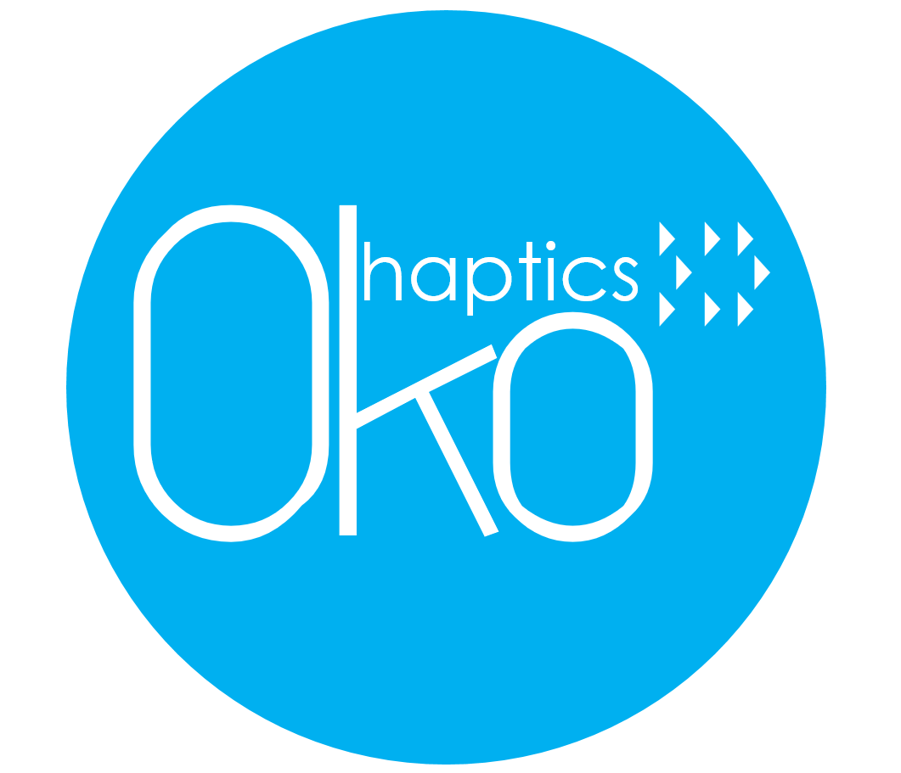

# 

## Setup

`pip install -r requirements.txt`

## Calibration
### Raspberry Pi
- Hold a checkered board in front of the stereo camera pair
- Run `collect_images.py`
  - This will create directory `/calibration_images` in the project foder
- Images captured from the left and right cameras are saved in this folder as
  - left_x.png and right_x.png
  - Where x is the image number
  - In the default setup 30 image pairs are collected
- Transfer the `oko-optics` project folder over to a computer for the calibration model development

### PC
- Transfer the `oko-optics` project folder to a PC from the source Raspberry Pi
- In the transferred folder run `run_calibration.py`
- This will create a `/calibration` folder in the project directory
  - `stereo_cal.pkl` contains the corrections to rectify stereo vision pairs via pixel remapping
  - `disparity_cal.pkl` contains the properties of the Stereo Block Matching algorithm used for depth extraction

## Usage

```(python)
import cv2
from depth_map import Camera, PostProcess
from wall_detect import FindWall
from floor_finder import FloorFinder


if __name__ == '__main__':
    processor = PostProcess()
    left = Camera.initialize(Camera.left)
    right = Camera.initialize(Camera.right)
    right_ = Camera.capture(right)
    right_rectified = processor.image_rectifier(right_, 'right')
    left_ = Camera.capture(left)
    left_rectified = processor.image_rectifier(left_, 'left')
    _hgt, _len, _ = right_.shape

    while True:
        left_ = Camera.capture(left)
        left_rectified = processor.image_rectifier(left_, 'left')
        floor_zone = FloorFinder.find(left_, (_hgt, _len))
        right_ = Camera.capture(right)
        right_rectified = processor.image_rectifier(right_, 'right')
        wall_warning = FindWall.find(right_)
        disparity = processor.get_disparity(_left_rectified=left_rectified, _right_rectified=right_rectified)
        depth_map = processor.depth_map(disparity)
        vibrations = processor.depth_intensity(depth_map, depth_map)
        cv2.imshow("left", left_)
        cv2.imshow("right", right_)
        cv2.imshow('depth', depth_map)
        if cv2.waitKey(190) == 27:
            break
    cv2.destroyAllWindows()
```

## Multiprocessing Background

The Oko-haptics project relies on `dask` and it's lazy operation features to allow for efficient multiprocessing of
images. Multiprocessing includes - 
- Floor finding
- Wall detection
- Stereo vision depth extraction

Documentation for lazy `dask` operations using `dask.delayed` can be found [here.](https://docs.dask.org/en/latest/delayed.html)

